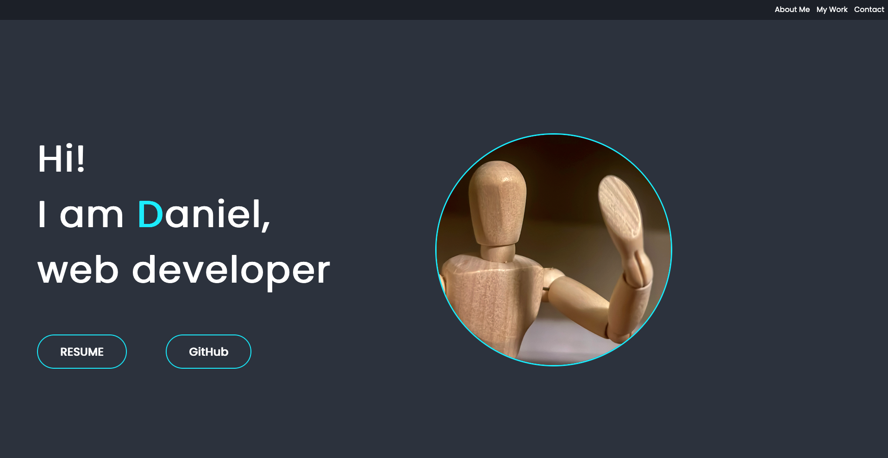

# My-Portfolio
I am Daniel Zarate and this is my portfolio made to showcase my work/progress as an upcomming programmer.

## Link
https://ch40s1.github.io/My-Portfolio/

## To view
Click the link in the README to view.

### To contribute
N/A

## Usage
View other Projects, check out their README and contribute. Contact me via social media.

## Credits
MDN web docs:
https://developer.mozilla.org/en-US/docs/Learn
This website was used as reference.

## Collaborators
Jude Clark - EdX Tutor. Sat June 10, 2023 (3:00pm Central time - U.S & Canada)
-(CSS Grid ideas)

## License
MIT license

### Features
Made with HTML and CSS
